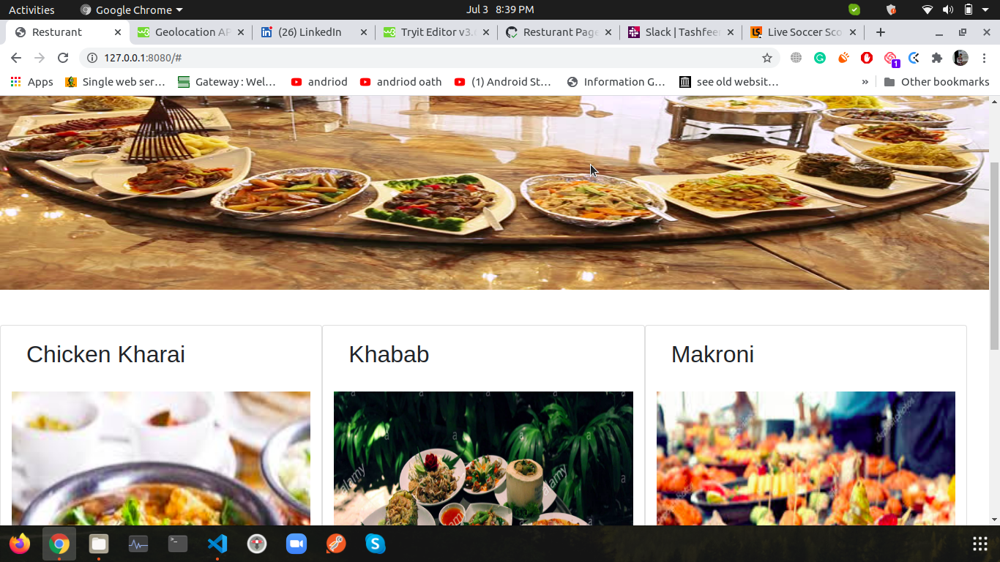

# Resturant Page

This is A simple Resturant menu Page.

## Built With

- Html
- CSS
- Javascript
- webpack

## Live Demo

[Live Demo Link](https://rawcdn.githack.com/Tahirbhalli/library/d7e7cd061b0291b55d95162225a92dc073f81c45/index.html)

## Authors

👤 **Tahir Ahmad**

- Github: [@tahirbhalli](https://github.com/tahirbhalli/)
- Twitter: [@tahirbhalli](https://twitter.com/tahirbhalli)
- Linkedin: [Tahir Ahmad](https://www.linkedin.com/in/tahirahmad16/)

## 🤝 Contributing

Contributions, issues and feature requests are welcome! Start by:
* Forking the project
* Cloning the project to your local machine
* `cd` into the Youtube-Replica project directory
* Run `git checkout -b your-branch-name`
* Make your contributions
* Push your branch up to your forked repository
* Open a Pull Request with a detailed description to the development branch of the original project for a review

## 📝 License

This project is [MIT](https://opensource.org/licenses/MIT) licensed.
